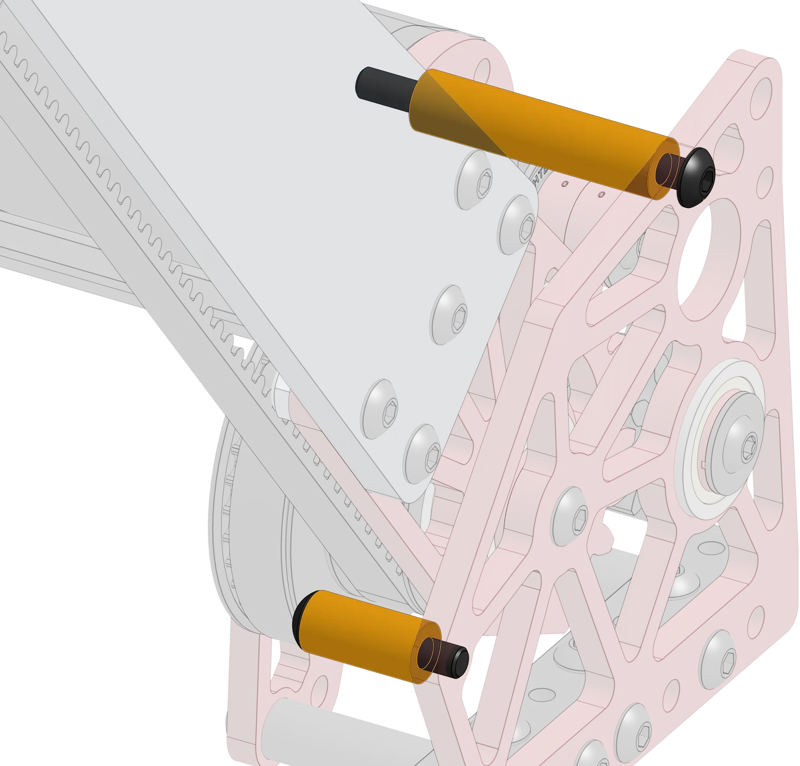
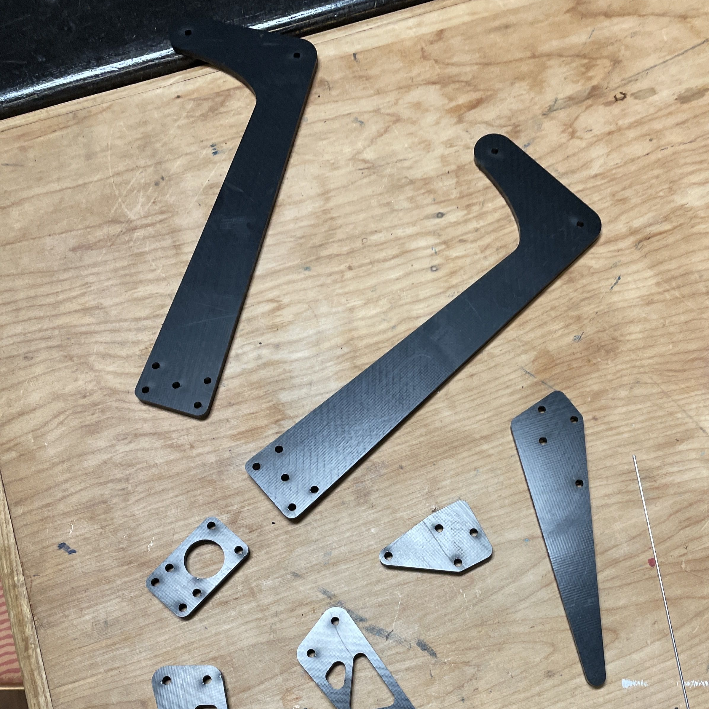
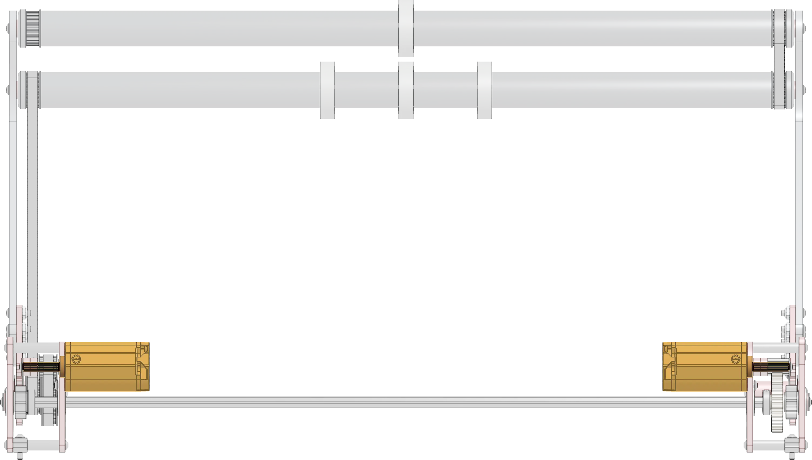
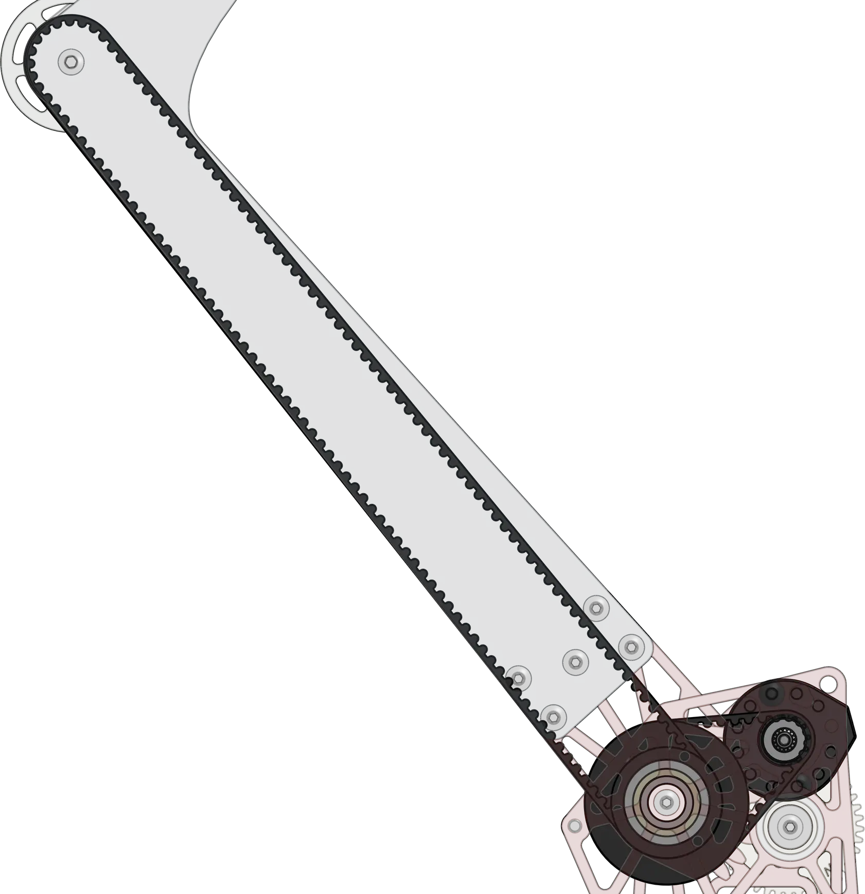
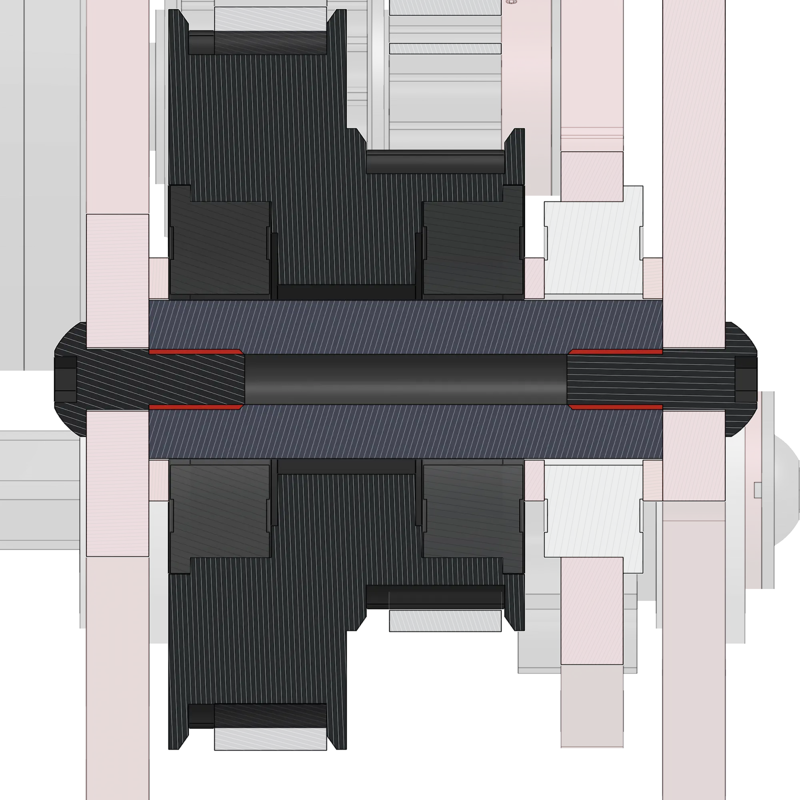
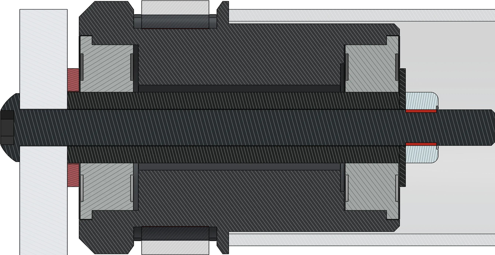

# 9442 Reefscape Algae Intake

<figure markdown="span">
    [{height=80% width=80%}](link-to-cad){target = "_blank"}
<figcaption>A motor driven slapdown intake with a sector gear pivot for intaking Reefscape Algae balls.</figcaption>
</figure>

### Links
[CAD Link](link){target = "_blank"}

## Behind the Design
This simple OTB intake was designed to be able to pick up Algae balls off the floor and push them into the end effector, but in doing so it places itself in harms way. When deployed, collisions with other robots and the field can damage the intake. As with other OTB designs, this [worded] the design requirements to be robust and resilient against collisions, while also  still being fast and lightweight. Weight was especially important, with the intake being a competition season upgrade.

|||
|:-:|:-:|
|<figure>{height=100% width=100%}<figcaption>A jackshaft is used to transmit torque across sides of the intake.</figure>|OTB intakes must be fast to actuate and durable. 9442 used a single Kraken X44 with a 13:1 ratio, which combined with the lightweight intake arms, allowed for an extremely fast actuation. The intake features a torque-transferring jackshaft that connects the left and right sides of the intake, as well as serving as the second stage of the reduction, connecting a 10DP spur gear to the 10DP sector gear on the intake arms.|

|||
|:-:|:-:| 
|The sector gear was chosen to provide a very compact and lightweight reduction when compared to a chain or belt pivot, saving the need for large and heavy sprockets and chain runs. It's important to support the jackshaft on both sides of any given set of gears to prevent it from bending under torque loads. Early versions of this intake were missing this support, resulting in the jackshaft bending and gears skipping.|<figure><figcaption>Intake powertrain. A 20DP reduction off of a Kraken X44 powers the 10DP sector gear reduction. The total reduction is only 13:1! This works thanks to a very lightweight intake arm.</figcaption>|

|||
|:-:|:-:|
|<figure>{height=70% width=70%}<figcaption>Bearings to support the jackshaft. It's important to avoid cantilevered loads on shafts as much as possible.</figcaption></figure>|<figure>{height=60% width=60%}<figcaption>Hardstops are used to define the stowed and deployed position, helping improve the controllability of the very low gear ratio. To save weight, a motor mount standoff is used for the stow position hardstop.</figcaption></figure>|

|||
|:-:|:-:|
|In order to keep weight down, many different techniques were used. One way weight was kept down was in the material choice of the intake. SRPP, a lightweight plastic composite with excellent stiffness and durability, was used for the intake arms. SRPP provided the durability needed to extend the intake outside of the frame perimeter, while also keeping the intake arms light enough for the intake to be fast.|<figure>{height=70% width=70%}<figcaption>An assortment of SRPP parts found on 9442's 2025 robot.</figcaption></figure>|

|||
|:-:|:-:|
|<figure>{height=70% width=70%}<figcaption>The two Kraken X44s (highlighted) found on the intake.</figcaption></figure>|Another technique used to keep reduce weight is motor choice. Only Kraken X44 motors were used in this intake. Kraken X44s save 0.45lbs per motor over a full sized Kraken X60, saving a total of 0.9lbs across the two motors used for the intake. Downstream from the motors, the small gear reduction, coupled with the compact sector gear pivot help to reduce weight needed for the pivot.|

|||
|:-:|:-:|
|Because of the very low gear reduction, the the moving parts of the intake needed to be kept as light as possible. To reduce the weight on the intake arms, a coaxial power transmission setup was used to move the power to the arms. This keeps the weight of a heavy motor off of the arms, reducing the power needed to actuate them.|<figure>{height=80% width=80%}<figcaption>A custom 3DP double pulley transmits the power from a Kraken X44 to the intake rollers.</figcaption></figure>|

Deadaxles were used for the pivot and the rollers in the intake. Deadaxles provide many benefits over liveaxle pivots and rollers. Deadaxle pivots eliminate the need to transmit torque through a shaft, preventing bending and twisting from torque, and saving on the weight of bearings to support the shaft. In the case of this intake, only a single bearing per side was needed, halving the two per side that would otherwise be required. For the rollers, stubbed deadaxle rollers were used. The stub axles are only a few inches long, saving weight over the full width axle in live and traditional deadaxle setups. The lack of a metal shaft going all the way through also increases toughness by preventing an axle from permanently bending in a collision. However, they may not be desireable in cases where high rigidity is required, as the only structure conneccting either side is a thin polycarbonate tube.

|||
|:-:|:-:|
|<figure>{height=70% width=70%}<figcaption>Cross-section of the deadaxle setup used for the pivot. Small hex shafts are held between the gearbox plates. The double pulley also spins around one of the dead axles.</figcaption></figure>|<figure>{height=60% width=60%}<figcaption>Cross-section of the stub deadaxle stack. A custom 3DP hub with two 0.375" ID bearings is slid over a standard #10-32 spacer. The whole stack is held in by a washer and a nut on the end. This setup is almost entirely COTS, the only custom component being the hub.</figcaption></figure>|
 

|||
|:-:|:-:|
|To mount the intake onto the rest of the robot, nut strips were used. Nut strips provide a rigid and simple way to mount plates.|