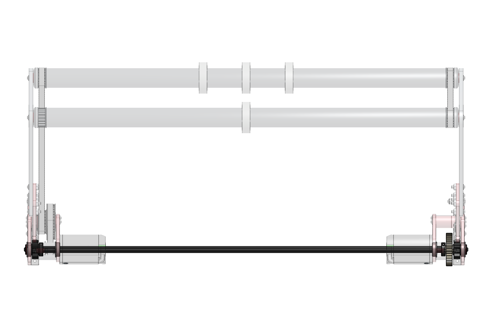
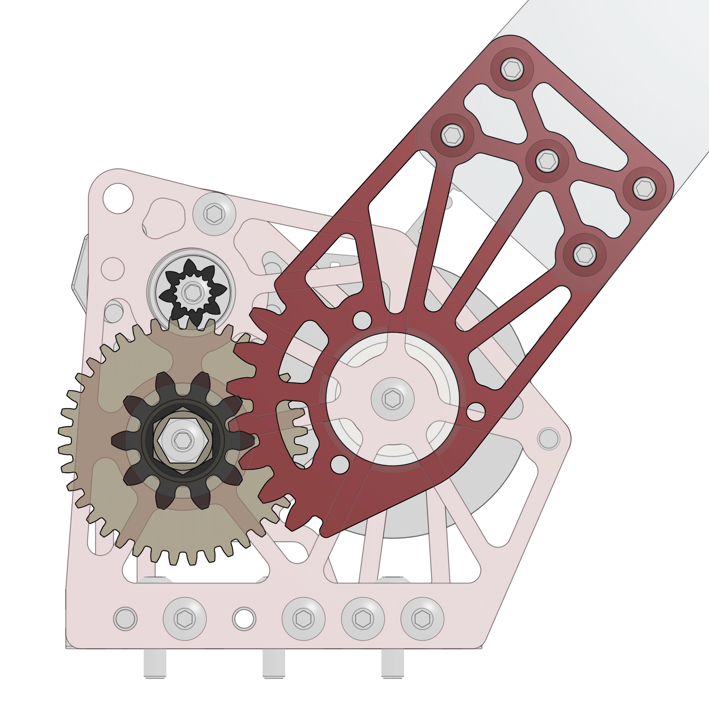
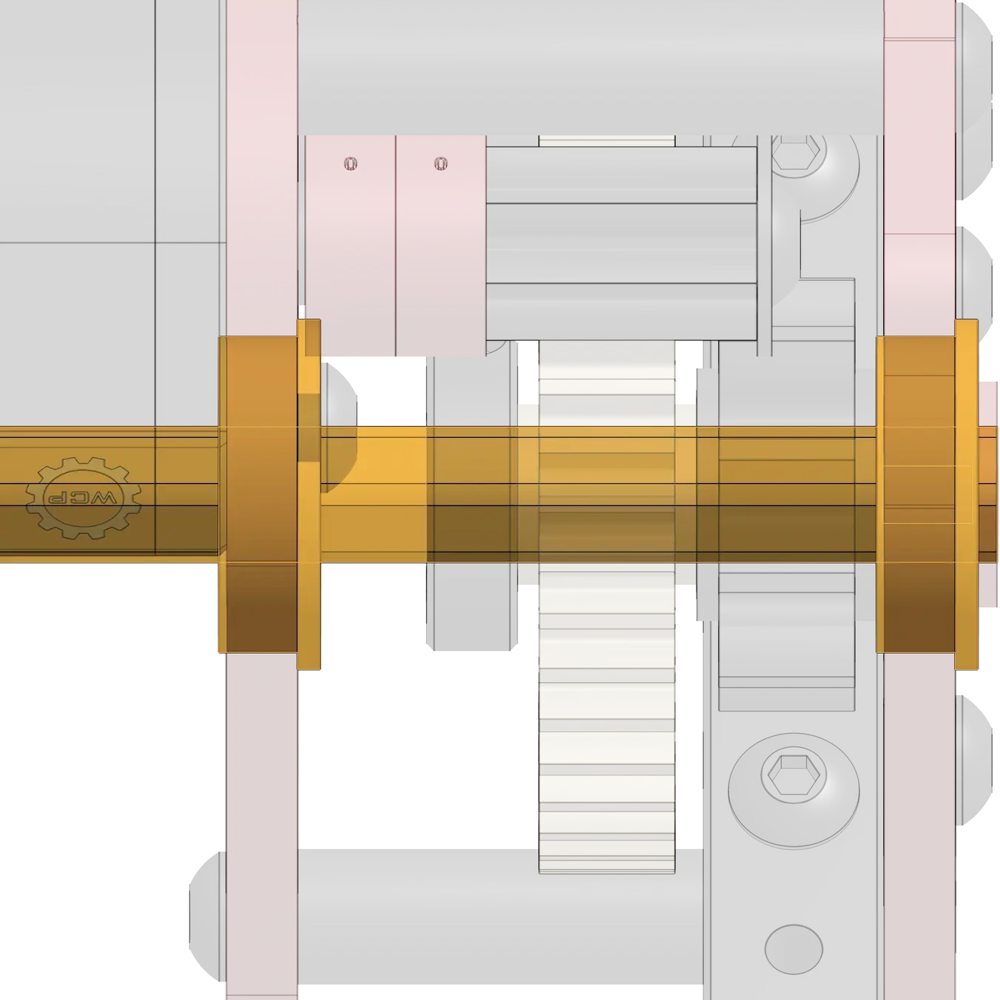

# 9442 Reefscape Algae Intake

<figure markdown="span">
    [{height=80% width=80%}](link-to-cad){target = "_blank"}
<figcaption>A motor driven slapdown intake with a sector gear pivot for intaking Reefscape Algae balls.</figcaption>
</figure>

### Links
[CAD Link](link){target = "_blank"}

## Behind the Design
This simple OTB intake was designed to be able to pick up Algae balls off the floor and push them into the end effector, but in doing so it places itself in harms way. When deployed, collisions with other robots and the field can damage the intake. As with other OTB designs, this [worded] the design requirements to be robust and resilient against collisions, while also  still being fast and lightweight. Weight was especially important, with the intake being a competition season upgrade.

|||
|:-:|:-:|
|<figure>{height=10% width=100%}<figcaption>A jackshaft is used to transmit torque across sides of the intake.</figure>|OTB intakes must be fast to actuate and durable. 9442 used a single Kraken X44 with a 13:1 ratio, which combined with the lightweight intake arms, allowed for an extremely fast actuation. The intake features a torque-transferring jackshaft that connects the left and right sides of the intake, as well as serving as the second stage of the reduction, connecting a 10DP spur gear to the 10DP sector gear on the intake arms. The sector gear was chosen to provide a very compact and lightweight reduction when compared to a chain or belt pivot, saving the need for large and heavy sprockets and chain runs. It's important to support the jackshaft on both sides of any given set of gears to prevent it from bending under torque loads. Early versions of this intake were missing this support, resulting in the jackshaft bending and gears skipping.|
|<figure><figcaption>Intake plate with 10DP gear profile.</figcaption>|<figure><figcaption>Bearings to support the jackshaft. It's important to avoid cantilevered loads on shafts as much as possible.</figcaption>

 