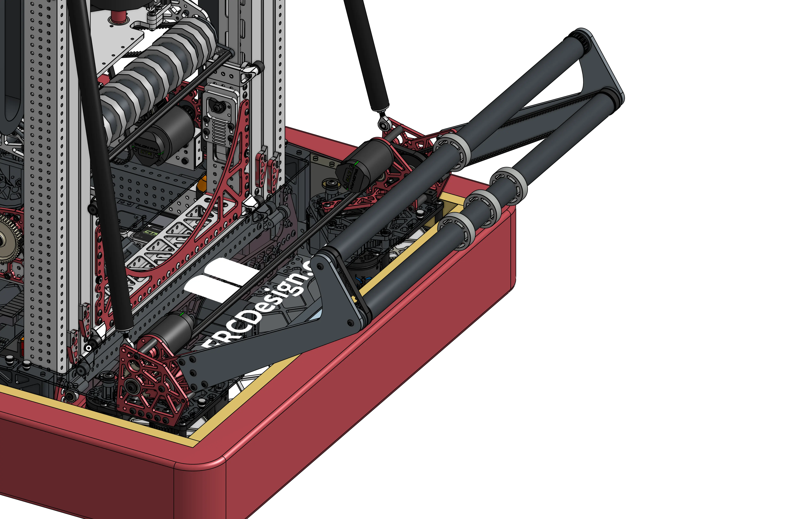

# 9442 Reefscape Algae Intake

<figure markdown="span">
    [{height=80% width=80%}](link-to-cad){target = "_blank"}
<figcaption>A motor driven slapdown intake with a sector gear pivot for intaking Reefscape Algae balls.</figcaption>
</figure>

### Links
[CAD Link](link){target = "_blank"}

## Behind the Design
This simple OTB intake was designed to be able to pick up Algae balls off the floor and push them into the end effector, but in doing so it places itself in harms way. When deployed, collisions with other robots and the field can damage the intake. As with other OTB designs, this [worded] the design requirements to be robust and resilient against collisions, while also  still binge fast and lightweight. Weight was especially important, with the intake being a competition season upgrade.

||||
|:-:|:-:|:-:|
|<figure>{height=120% width=120%}<figcaption> Always include a way to tension your chains! </figcaption></figure>| OTB intakes must actuate quickly and accurately, so a motor is a good choice to power them. 1678 used a single Falcon 500 with a 30:1 ratio. This intake featured a torque transfer shaft (highlighted yellow in the image) to transfer power to both sides of the intake. Driving both sides of the intake pivot prevents the entire intake from bending under the loads of extension and retraction. The pivot itself is driven by chain on a 32t plate sprocket. Using a chain for the final reduction and power transmission is optimal due to its ability to absorb shock loads.|<figure>{height=120% width=120%}<figcaption> These screws and washers prevent bearings from popping out during impacts. </figcaption></figure>|

|||
|:-:|:-:|
| The intake rollers are powered by a Falcon 500, and power is transferred using HTD 5mm timing belts. The intake is designed with the "touch it own it" design philosophy, and it spans the full width of the robot to make intaking as easy as possible for the driver. The intake is "geared" (using belt and pulley reductions) so that the surface speed of the rollers are approximately 2.5x the speed of the robot. This allows the robot to intake balls even while driving into them at full speed. Each level of wheels is also belted together such that they have equal surface speeds, despite their different diameters. |<figure>{height=200% width=200%}<figcaption>It is important to take the diameter of your intake wheels/rollers into account because it may effect their surface speeds.</figcaption></figure>|

***

This intake takes many special considerations to increase its survivability and robustness

|||
|:-:|:-:|
|<figure>{height=200% width=200%}<figcaption>The first stage of rollers has two belts powering it for redundancy, just in case one belt is damaged.</figcaption></figure>|<figure>{height=64% width=64%}<figcaption>Pulleys feature extra-large flanges to prevent belts from slipping off.</figcaption></figure>|

|||
|:-:|:-:|
|<figure>{height=200% width=200%}</figure>|Intake plates are manufactured from 1/4" polycarbonate, which is the most common intake material due to its strength to weight ratio and ability to return to its original shape after deforming. This intake has extra aluminum reinforcement on the areas most susceptible to breaking.|

|||
|:-:|:-:|
|<figure>{height=200% width=200%}<figcaption>Intake hardstopped in its down position.</figcaption></figure>|<figure>{height=65% width=65%}<figcaption>Intake hardstopped in its up position</figcaption></figure>|

 1678 designed their intake polycarbonate plates to hardstop on each other in both the fully extended and retracted positions. This makes programming the intake easier, and helps the robot pass inspection by proving that the intake cannot extend past the frame perimeter extension limit. In a pneumatically actuated intake, having the pivot plates hardstop allows for some error margin on the pneumatic piston's stroke.

***

## 
 See this Intake in Action Here 

!!! Tip
    Click the images to watch the videos.

 

 